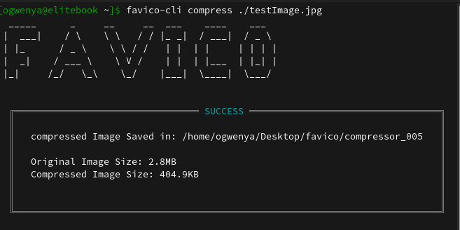

Favico is a cli tool to generate `favicon` image and other icons such as `apple-touch-icon` and `android-chrome` of various sizes.

Generated icons are stored in `Desktop/favico` directory.

## Installation

```bash
npm i -g favico-cli
```

## commands

| Command                              | Description           |
| ------------------------------------ | --------------------- |
| `favico-cli --version`               | check current version |
| `favico-cli g /path/to/image`        | generate a favicon    |
| `favico-cli generate /path/to/image` | generate a favicon    |
| `favico-cli compress /path/to/image` | compress an image     |
| `favico-cli c /path/to/image`        | compress an image     |

### Examples

#### Generating an icon

```bash
favico-cli generate ./logo.png
```

or

```bash
favico-cli g ./logo.png
```


#### Compressing an Image

```bash
favico-cli compress ./testImage.jpg
```

or

```bash
favico-cli c ./testImage.jpg
```


